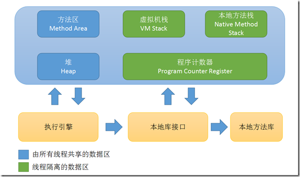
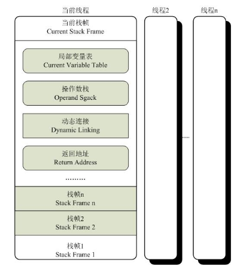
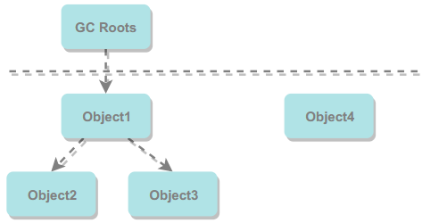
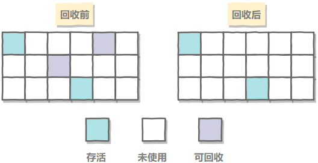
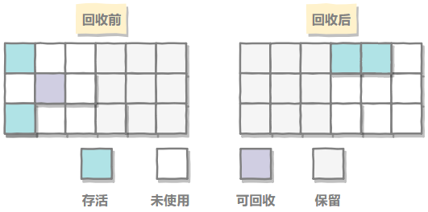
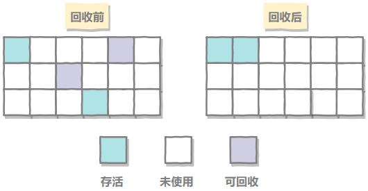

# 一、运行时数据区域

<div align="center">  </div><br>

## 程序计数器

- 可看作当前线程所执行的字节码的行号指示器。
- 线程私有。
- 占用较小的内存空间。
- 是唯一一个没有规定任何OutOfMemoryError情况的区域。
- 若线程正在执行的是一个Java方法，则计数器记录的是正在执行的虚拟机字节码指令的地址；若线程正在执行的是Native方法，则计数器的值为空。

## Java 虚拟机栈

- 描述的是 Java 方法执行的内存模型。
- 线程私有。
- 生命周期和线程相同。
- 每个 Java 方法在执行的同时会创建一个栈帧用于存储局部变量表、操作数栈、动态链接、方法出口等信息。从方法调用直至执行完成的过程，就对应着一个栈帧在 Java 虚拟机栈中入栈和出栈的过程。
- 异常：当线程请求的栈深度超过最大值，会抛出 StackOverflowError 异常；栈进行动态扩展时如果无法申请到足够内存，会抛出 OutOfMemoryError 异常。
- 可以通过 -Xss 这个虚拟机参数来指定每个线程的 Java 虚拟机栈内存大小：
```java java -Xss512M HackTheJava```

<div align="center">  </div>

## 本地方法栈
- 线程私有
- 与 Java VM 栈类似。
- VM 栈为 VM 执行 Java 方法（字节码）服务，本地方法栈为 VM 使用的 Native 方法服务。
- 异常：StackOverflowError、OutOfMemoryError
- 本地方法一般是用其它语言（C、C++ 或汇编语言等）编写的，并且被编译为基于本机硬件和操作系统的程序，对待这些方法需要特别处理。

## 堆
- 线程共享。
- 所占内存最大，虚拟机启动时创建。
- 几乎所有对象都在这里分配内存，是垃圾收集的主要区域（"GC 堆"）。
- 现代的垃圾收集器基本都是采用分代收集算法，其主要的思想是针对不同类型的对象采取不同的垃圾回收算法，可以将堆分成两块：新生代（Young Generation）、老年代（Old Generation）。
- 进一步划分的目的：更好的回收、更快的分配内存。
- 堆不需要连续内存，并且可以动态增加其内存，增加失败会抛出 OutOfMemoryError 异常。
- 可以通过 -Xms 和 -Xmx 两个虚拟机参数来指定一个程序的堆内存大小，第一个参数设置初始值，第二个参数设置最大值。
```java java -Xms1M -Xmx2M HackTheJava```

## 方法区

- 线程共享。
- 用于存放已被加载的类信息、常量、静态变量、即时编译器编译后的代码等数据。
- 不需要连续的内存，可以动态扩展，可选择不实现垃圾收集。
- 方法区无法满足内存分配需求时，会抛出 OutOfMemoryError 异常。
- 对这块区域进行垃圾回收的主要目标是对常量池的回收和对类的卸载，但是一般比较难实现。
- HotSpot 虚拟机把它当成永久代来进行垃圾回收。但是很难确定永久代的大小，因为它受到很多因素影响，并且每次 Full GC 之后永久代的大小都会改变，所以经常会抛出 OutOfMemoryError 异常。为了更容易管理方法区，从 JDK 1.8 开始，移除永久代，并把方法区移至元空间，它位于本地内存中，而不是虚拟机内存中。

## 运行时常量池

- 运行时常量池是方法区的一部分。
- Class 文件中的常量池（存放编译期生成的各种字面量和符号引用）会在类加载后被放入这个区域。
- 除了在编译期生成的常量，还允许动态生成，eg: String 类的 intern()。
- 常量池无法再申请到内存时会抛出 OutOfMemoryError 异常。

## 直接内存

- 非虚拟机运行时数据区的一部分，非 Java 虚拟机规范中定义的内存区域。
- 可能导致 OutOfMemoryError 异常。 
- 在 JDK 1.4 中新加入了 NIO 类，它可以使用 Native 函数库直接分配堆外内存（Native 堆），然后通过一个存储在 Java 堆里的 DirectByteBuffer 对象作为这块内存的引用进行操作。
- 这样能在一些场景中显著提高性能，因为避免了在 Java 堆和 Native 堆中来回复制数据。

# 二、垃圾收集

垃圾收集主要是针对堆和方法区进行。

程序计数器、虚拟机栈和本地方法栈这三个区域属于线程私有的，只存在于线程的生命周期内，线程结束之后也会消失，因此不需要对这三个区域进行垃圾回收。

## 判断一个对象是否可被回收

### 1. 引用计数算法

- 给对象添加一个引用计数器，当对象增加一个引用时计数器加 1，引用失效时计数器减 1。引用计数为 0 的对象可被回收。
- 两个对象出现循环引用的情况下，此时引用计数器永远不为 0，导致无法对它们进行回收。
- 正因为循环引用的存在，因此 Java 虚拟机不使用引用计数算法。
- 优：实现简单；缺：无法解决循环引用的问题。

```java
public class ReferenceCountingGC {

    public Object instance = null;
	private static final int _1MB = 1024 * 1024;
	private byte[] bigSize = new byte[2 * _1MB];

    public static void testGC() {
        ReferenceCountingGC objA = new ReferenceCountingGC();
        ReferenceCountingGC objB = new ReferenceCountingGC();
        objA.instance = objB;
        objB.instance = objA;
		
		objA = null;
		objB = null;

		System.gc();
    }
}
```

### 2. 可达性分析算法

- 通过 GC Roots 作为起始点
- 从起始点开始向下搜索
- 搜索走过的路径称为引用链
- 当一个对象到 GC Roots 没有任何引用链相连时，则此对象不可用，可被回收

<div align="center">  </div><br>
Java 虚拟机使用该算法来判断对象是否可被回收，在 Java 中 GC Roots 一般包含以下内容：

- 虚拟机栈（栈帧中的本地变量表）中引用的对象
- 方法区中类静态属性引用的对象
- 方法区中的常量引用的对象
- 本地方法栈中 JNI（即一般说的Native方法）中引用的对象


### 3. 方法区的回收

- 因为方法区主要存放永久代对象，而永久代对象的回收率比新生代低很多，因此在方法区上进行回收性价比不高。
- 主要是对常量池的回收和对类的卸载。
- 在大量使用反射、动态代理、CGLib 等 ByteCode 框架、动态生成 JSP 以及 OSGi 这类频繁自定义 ClassLoader 的场景都需要虚拟机具备类卸载功能，以保证不会出现内存溢出。

类的卸载条件很多，需要满足以下三个条件，并且满足了也不一定会被卸载：

- 该类所有的实例都已经被回收，也就是堆中不存在该类的任何实例。
- 加载该类的 ClassLoader 已经被回收。
- 该类对应的 Class 对象没有在任何地方被引用，也就无法在任何地方通过反射访问该类方法。

可以通过 -Xnoclassgc 参数来控制是否对类进行卸载。

### 4. finalize()

- finalize() 类似 C++ 的析构函数，用来做关闭外部资源等工作。但是 try-finally 等方式可以做的更好，故可忽略这个方法的存在。

- 当一个对象可被回收时，如果需要执行该对象的 finalize() 方法，那么就有可能在该方法中让对象重新被引用，从而实现自救。自救只能进行一次，如果回收的对象之前调用了 finalize() 方法自救，后面回收时不会调用 finalize() 方法。

## 引用类型

无论是通过引用计算算法判断对象的引用数量，还是通过可达性分析算法判断对象是否可达，判定对象是否可被回收都与引用有关。

Java 提供了四种强度不同的引用类型。

### 1. 强引用

被强引用关联的对象不会被回收。

使用 new 一个新对象的方式来创建强引用。

```java
Object obj = new Object();
```

### 2. 软引用

被软引用关联的对象只有在内存不够的情况下才会被回收。

使用 SoftReference 类来实现软引用。

回收后，内存仍然不足，则抛异常。

```java
Object obj = new Object();
SoftReference<Object> sf = new SoftReference<Object>(obj);
obj = null;  // 使对象只被软引用关联
```

### 3. 弱引用

被弱引用关联的对象只能存活到下一次垃圾回收发生之前。

使用 WeakReference 类来实现弱引用。

```java
Object obj = new Object();
WeakReference<Object> wf = new WeakReference<Object>(obj);
obj = null;
```

### 4. 虚引用

幽灵引用 / 幻影引用。

一个对象是否有虚引用的存在，完全不会对其生存时间构成影响，也无法通过虚引用取得一个对象。

为一个对象设置虚引用关联的唯一目的就是能在这个对象被回收时收到一个系统通知。

使用 PhantomReference 来实现虚引用。

```java
Object obj = new Object();
PhantomReference<Object> pf = new PhantomReference<Object>(obj);
obj = null;
```

## 垃圾收集算法

### 1. 标记 - 清除

<div align="center">  </div><br>

过程：

- （1）标记：标记出所有需要回收的对象；
- （2）清除：统一回收所有被标记的对象。

不足：

- （1）效率：标记和清除过程效率都不高；
- （2）空间：会产生大量不连续的内存碎片，导致无法给大对象分配内存，提前触发垃圾回收。

### 2. 复制

<div align="center">  </div><br>

过程：

- 将可用内存按容量大小划分为相等的两块，每次只使用其中的一块；
- 一块内存使用完后，将存活的对象复制到另一块上面；
- 把使用过的内存空间一次清理掉。

优点：实现简单、运行高效；
缺点：可使用内存变为原来的一半。

现在的商业虚拟机都采用这种收集算法来回收新生代，但是并不是将新生代划分为大小相等的两块，而是分为一块较大的 Eden 空间和两块较小的 Survivor 空间，每次使用 Eden 空间和其中一块 Survivor。在回收时，将 Eden 和 Survivor 中还存活着的对象一次性复制到另一块 Survivor 空间上，最后清理 Eden 和使用过的那一块 Survivor。

HotSpot 虚拟机的 Eden 和 Survivor 的大小比例默认为 8:1，保证了内存的利用率达到 90%。如果每次回收有多于 10% 的对象存活，那么一块 Survivor 空间就不够用了，此时需要依赖于老年代进行分配担保，也就是借用老年代的空间存储放不下的对象。

### 3. 标记 - 整理

<div align="center">  </div><br>

过程：

- （1）标记：标记出所有需要回收的对象；
- （2）清除：让所有存活的对象都向一端移动，然后直接清理掉端边界以外的内存。

优点：不产生内存碎片；
缺点：移动对象较多，处理效率较低。

### 4. 分代收集

现在的商业虚拟机采用分代收集算法，它根据对象存活周期将内存划分为几块，不同块采用适当的收集算法。

一般将堆分为新生代和老年代。

- 新生代使用：复制算法
- 老年代使用：标记 - 清除 或者 标记 - 整理 算法

## 垃圾收集器

<div align="center">  </div><br>

以上是 HotSpot 虚拟机中的 7 个垃圾收集器，连线表示垃圾收集器可以配合使用。

- 单线程与多线程：单线程指的是垃圾收集器只使用一个线程进行收集，而多线程使用多个线程；
- 串行与并行：串行指的是垃圾收集器与用户程序交替执行，这意味着在执行垃圾收集的时候需要停顿用户程序；并行指的是垃圾收集器和用户程序同时执行。除了 CMS 和 G1 之外，其它垃圾收集器都是以串行的方式执行。

### 1. Serial 收集器

<div align="center">  </div><br>

- 单线程收集器
- 只会使用一个 CPU 或一条收集线程去完成垃圾收集工作
- 运行时必须暂停其他所有工作线程，直到它收集结束（Stop The World）
- 虚拟机运行在 Client 模式下的默认新生代收集器

优点：简单高效，对于单个 CPU 环境来说，由于没有线程交互的开销，因此拥有最高的单线程收集效率。

Client 模式下的默认新生代收集器，因为在该应用场景下，分配给虚拟机管理的内存一般来说不会很大。Serial 收集器收集几十兆甚至一两百兆的新生代停顿时间可以控制在一百多毫秒以内，只要不是太频繁，这点停顿是可以接受的。

### 2. ParNew 收集器

<div align="center">  </div><br>

- Serial 收集器的多线程版本。
- 是 Server 模式下的虚拟机首选【新生代】收集器，除了性能原因外，主要是因为除了 Serial 收集器，只有它能与 CMS 收集器配合工作。
- 默认开启的线程数量与 CPU 数量相同，可以使用 -XX:ParallelGCThreads 参数来设置线程数。

### 3. Parallel Scavenge 收集器

- 新生代收集器、复制算法、并行多线程收集器。
- 其它收集器关注点是尽可能缩短垃圾收集时用户线程的停顿时间，而它的目标是达到一个【可控制的吞吐量】，它被称为“吞吐量优先”收集器。这里的吞吐量指 CPU 用于运行用户代码的时间占总时间的比值。
- 停顿时间越短就越适合需要与用户交互的程序，良好的响应速度能提升用户体验。而高吞吐量则可以高效率地利用 CPU 时间，尽快完成程序的运算任务，适合在【后台运算而不需要太多交互的任务】。
- 缩短 GC 停顿时间是以牺牲吞吐量和新生代空间来换取的：新生代空间变小，垃圾回收变得频繁，导致吞吐量下降。
- 可以通过一个开关参数打开 GC 自适应的调节策略（GC Ergonomics），就不需要手工指定新生代的大小（-Xmn）、Eden 和 Survivor 区的比例、晋升老年代对象年龄等细节参数了。虚拟机会根据当前系统的运行情况收集性能监控信息，动态调整这些参数以提供最合适的停顿时间或者最大的吞吐量。

# 参考资料

- 周志明. 深入理解 Java 虚拟机 [M]. 机械工业出版社, 2014.
