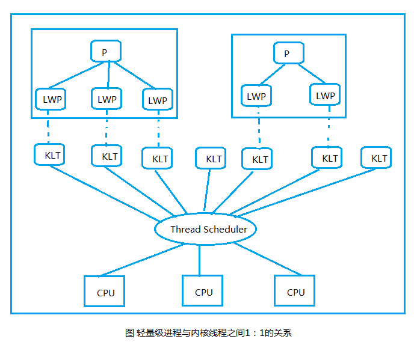
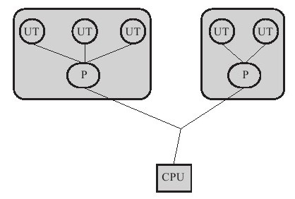
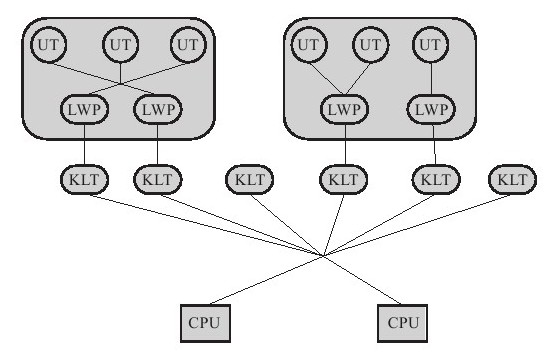
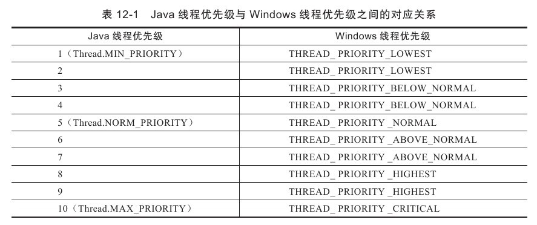
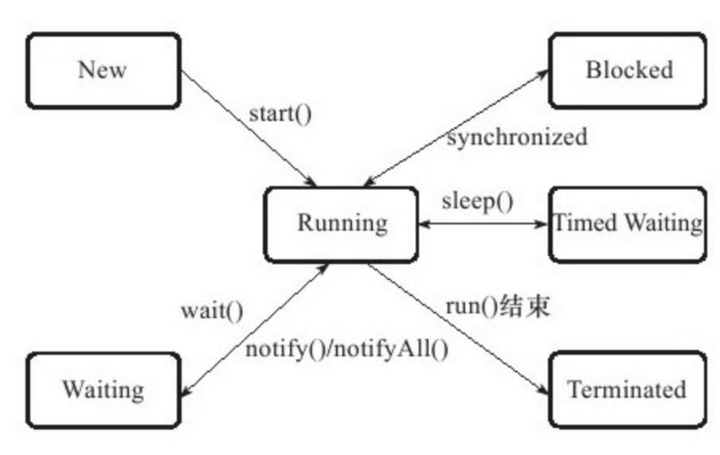
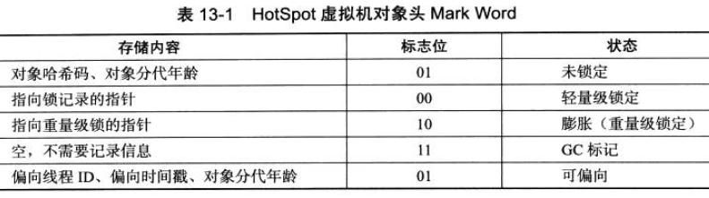
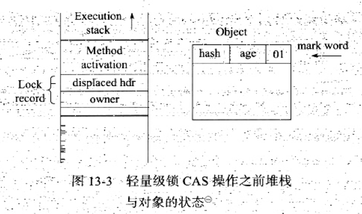
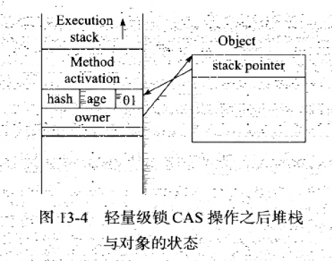
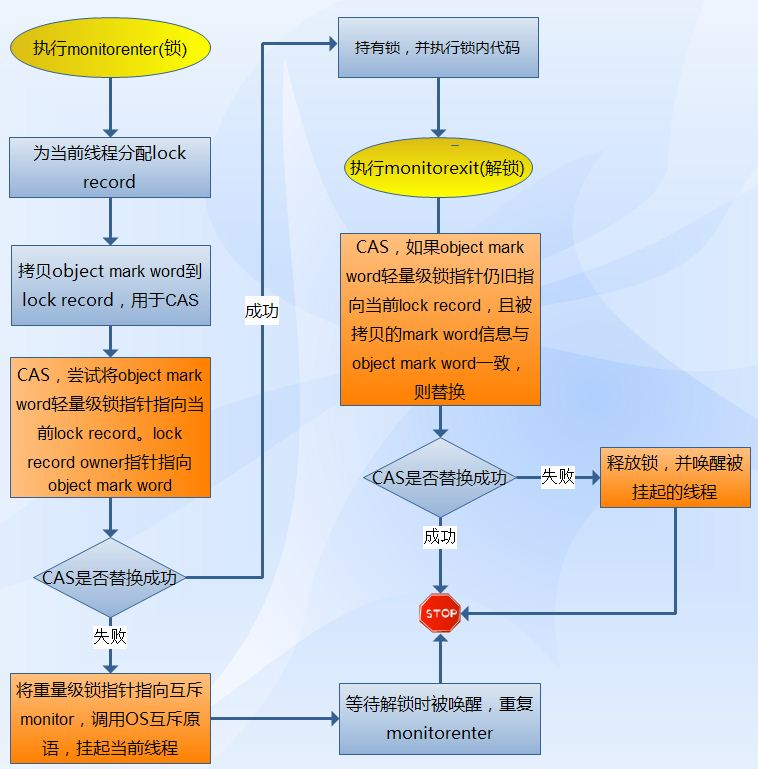
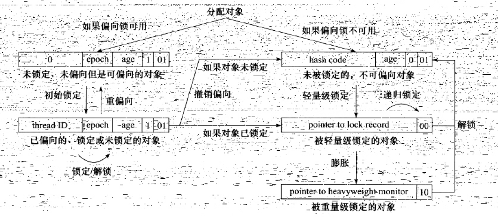

# 一、物理计算机中的问题

## 1、为什么会有高速缓存

- 计算机存储设备和处理器的运算速度有几个数量级的差距；
- 加入一层读写速度尽可能接近处理器运算速度的高速缓存（Cache）作为内存与处理器之间的缓冲。

## 2、运行过程：

- 将运算需要使用到的数据复制到缓存中，让运算能快速运行；
- 运算结束，再从缓存同步回内存；
- 结果：处理器无需等待缓慢的内存读写。

## 3、问题出现：

- 缓存一致性（Cache Coherence）

## 4、问题原因：

- 多处理器系统，每个处理器都有自己的Cache，而这些处理器又共享同一个主内存
- 多个处理器的运算任务涉及到同一块主存区域，将导致各自缓存不一致

  

## 5、问题解决：

- 缓存一致性协议（MSI、MESI、MOSI......）

## 6、内存模型：

- 特定操作协议下，对特定的内存或高速缓存进行读写访问的过程抽象。

## 7、乱序优化：

- 为了使得处理器内部的运算单元能尽量被充分利用，处理器可能会对输入代码进行乱序执行（Out-Of-Order Execution）优化。
- 处理器会在计算之后将乱序执行的结果重组，保证该结果与顺序执行的结果是一致的，但并不保证程序中各个语句计算的先后顺序与输入代码中的顺序一致。
- 如果存在一个计算任务依赖于另一个计算任务的中间结果，那么其顺序性并不能靠代码的先后顺序来保证。

# 二、Java 内存模型
Java 内存模型的作用：

- 屏蔽各种硬件和操作系统的内存访问差异；
- 实现让 Java 程序在各个平台下都能达到一致的内存访问效果。
## 1、主内存与工作内存
Java 内存模型的主要目标：

- 定义程序中各个“变量”的访问规则；
- 此处的“变量”包括实例字段、静态字段和构成数组对象的元素；
- 因局部变量与方法参数是线程私有【注1】，不会被共享，不存在竞争问题，所以“变量”不包括他们。

Java 内存模型规定：

- 所有的变量都存储在主内存
- 每条线程有自己的工作内存
- 工作内存保存了被该线程使用到的变量的主内存副本拷贝【注2】
- 线程对变量的所有操作都是在工作内存中进行的，不可直接读写主内存中的变量【注3】
- 不同线程无法直接访问对方工作内存中的变量
- 线程间变量值的传递都需要通过主内存来完成

  

从上图来看：硬件 <===> Java 虚拟机

- 处理器   <===> Java 线程
- 高速缓存 <===> 工作内存
- 缓存一致性协议 <===> Save 和 Load 操作

注意：

- 若局部变量是 reference 类型，它引用的对象在 Java 堆中可能被各个线程共享，但是 reference 本身在 Java 栈的局部变量表中，它是线程私有的。
- 拷贝副本：假设线程中访问10M的对象，也会把10M内存复制一份吗？不会。这个对象的引用、对象在某个线程访问到的字段是有可能存在拷贝的，但不会把整个对象拷贝一份。
- volatile 变量依然有工作内存的拷贝，但是由于它特殊的操作顺序性规定，所以看起来好像是直接在主内存中读写一样。
## 2、内存间交互操作
8种原子操作：

- lock(锁定)：作用于主内存中的变量，把一个变量标识为一条线程独占的状态。
- unlock(解锁)：作用于主内存中的变量，把一个处于锁定状态的变量释放出来，之后可被其它线程锁定。
- read(读取)：作用于主内存中的变量，把一个变量的值从主内存传输到线程的工作内存中，以便随后的load动作使用。
- load(加载)：作用于工作内存中的变量，把read操作从主内存中得到的变量的值放入工作内存的变量副本中。
- use(使用)：作用于工作内存中的变量，把工作内存中一个变量的值传递给执行引擎。
- assign(赋值)：作用于工作内存中的变量，把一个从执行引擎接收到的值赋值给工作内存中的变量。
- store(存储)：作用于工作内存中的变量，把工作内存中的一个变量的值传送到主内存中。
- write(写入)：作用于主内存中的变量，把store操作从工作内存中得到的变量的值放入主内存的变量中。

注意：

- 把变量从主内存复制到工作内存，必须顺序执行 read 和 load
- 把变量从工作内存同步到主内存，必须顺序执行 store 和 write
- 上述操作必须顺序执行，但不要求连续执行

执行8种基本操作时的规则：

- 不允许read和load、store和write操作之一单独出现。即不允许一个变量从主内存被读取了，但是工作内存不接受，或者从工作内存回写了但是主内存不接受。
- 不允许一个线程丢弃它最近的一个assign操作，即变量在工作内存被更改后必须同步改更改回主内存。 
- 工作内存中的变量在没有执行过assign操作时，不允许无意义的同步回主内存。
- 在执行use前必须已执行load，在执行store前必须已执行assign。 
- 一个变量在同一时刻只允许一个线程对其执行lock操作，一个线程可以对同一个变量执行多次lock，但必须执行相同次数的unlock操作才可解锁。
- 一个线程在lock一个变量的时候，将会清空工作内存中的此变量的值，执行引擎在use前必须重新read和load。
- 线程不允许unlock其他线程的lock操作。并且unlock操作必须是在本线程的lock操作之后。
- 在执行unlock之前，必须首先执行了store和write操作。

上述规则完全确定Java程序中哪些内存访问操作在并发下是安全的。

上述规则的等价定义---先行发生原则。
## 3、volatile 型变量的特殊规则
volatile 变量的两种特性：

- ①保证该变量对所有线程的可见性【这是与普通变量的最大区别】。即一个线程修改了volatile变量的值，新值对于其他线程来说是可立即得知的。
- ②禁止指令重排序

注意：

- volatile变量在各个线程的工作内存中也存在不一致的情况，但是由于每次使用之前都要先刷新，执行引擎看不到不一致的情况，因此可认为不存在一致性问题。
- 但Java中的运算并非原子操作，导致volatile变量的运算在并发情况下一样是不安全的。

总结：

- volatile 变量只能保证可见性
- 不能保证原子性的情况，需要加锁来保证原子性（使用 synchronized 或 java.util.concurrent 中的原子类）
- 保证原子性的情况：确保只有单一线程修改变量值，且变量不需要与其他状态变量共同参与不变约束。

选用 volatile 的意义：

- volatile 变量的读操作性能消耗和普通变量几乎没有什么区别，但是写操作可能会慢些（因需要插入内存屏障指令来保证处理器不发生乱序执行）
- volatile 与 锁 如何选择？就看 volatile 的语义能否满足使用场景的需求。

## 4、long/double 型变量的特殊规则
long 和 double 的非原子性协定：

- 允许虚拟机将没有被 volatile 修饰的 64 位数据的读写操作划分位两次 32 位的操作，即允许虚拟机实现选择可以不保证 64 位数据类型的 load、store、read 和 write 这个 4 个操作的原子性。
## 5、原子性、可见性与有序性
原子性：

- Java 内存模型来直接保证的原子性变量操作包括 read、load、assign、use、store、write
- 可认为基本数据类型的访问读写是具备原子性的（忽略long、double）
- 如果需要更大原子性的保证，可使用 加锁 操作

可见性：

- 指当一个线程修改了共享变量的值，其他线程能立即得知这个修改。
- 实现：Java内存模型是通过变量在修改后将新值同步回主内存，在变量读取前从主内存刷新变量值这种依赖主存作为媒介的方式实现可见性。
- synchronized 和 final 也可实现可见性。
- 同步块的可见性由“对一个变量执行 unlock 操作之前，必须把此变量同步回主内存中”这条规则获得。
- final 关键字的可见性“被final修饰的字段在构造器中一旦被初始化完成，并且构造器没有把“this”的引用传递出去，那么其他线程中就能看见final字段的值。”

有序性：

- Java程序中天然的有序性可以总结为一句话：如果在本线程内观察，所有的操作都是有序的；如果在一个线程中观察另外一个线程，所有的操作都是无序的。
- 前半句是指“线程内表现为串行的语义”（Within-Thread As-if-Serial Semantics），后半句是指“指令重排序”现象和“工作内存与主内存同步延迟”现象。
- Java语言提供了volatile和synchronized两个关键字来保证线程之间操作的有序性，volatile关键字本身就包含了禁止指令重排序的语义，而synchronized则是由“一个变量在同一时刻只允许一条线程对其进行lock操作”这条规则获得的，这个规则决定了持有同一个锁的两个同步块只能串行地进入。

## 6、先行发生原则
- Java内存模型中定义的两项操作之间的偏序关系，如果操作A先行发生于操作B，其实就是说在发生操作B之前，操作A产生的影响能被操作B观察到，“影响”包括修改了内存中共享变量的值/发送了消息/调用了方法等。

Java内存模型下一些“天然的”先行发生关系：

- 程序次序规则（Program Order Rule）：在一个线程内，按照程序代码顺序，书写在前面的操作先行发生于书写在后面的操作。准确地来说应该是控制流顺序而不是程序代码顺序，因为要考虑分支/循环结构。
- 管程锁定规则（Monitor Lock Rule）：一个unlock操作先行发生于后面对同一锁的lock操作。这里必须强调的是同一锁，而“后面”是指时间上的先后顺序。
- volatile变量规则（Volatile Variable Rule）：对一个volatile变量的写操作先行发生于后面对这个变量的读操作，这里的“后面”是指时间上的先后顺序。
- 线程启动规则（Thread Start Rule）：Thread对象的start()方法先行发生于此线程的每一个动作。
- 线程终止规则（Thread Termination Rule）：线程中的所有操作都先行发生于对此线程的终止检测，我们可以通过Thread.join()方法结束/Thread.isAlive()的返回值等手段检测到县城已经终止执行。
- 线程中断规则（Thread Interruption Rule）：对线程interrupt()方法的调用先行发生于被中断线程的代码检测到中断事件的发生，可以通过Thread.interrupted()方法检测到是否有中断发生。
- 对象终结规则（Finalizer Rule）：一个对象的初始化完成（构造函数执行结束）先行发生于它的finalize()方法的开始。
- 传递性（Transitivity）：如果操作A先行发生于操作B，操作B先行发生于操作C，那么操作A先行发生于操作C。

# 三、Java 与线程
并发不一定依赖多线程，但是Java里面谈论并发，大多数与线程脱不开关系。

## 1、线程的实现
实现线程主要三种方式：

- 使用内核线程实现
- 使用用户线程实现
- 使用用户线程加轻量级进程混合实现

### （1）使用内核线程实现
- 内核线程（Kernel Thread， KLT）就是直接由操作系统内核（Kernel，下称内核）支持的线程
- 内核来完成线程切换，内核通过操纵调度器（Scheduler）对线程进行调度，并负责将线程的任务映射到各个处理器上。
- 每个内核线程都可以看作是内核的一个分身，这样操作系统就有能力同时处理多件事情，支持多线程的内核就叫多线程内核。
- 程序一般不会直接去使用内核线程，而是去使用内核线程的一种高级接口——轻量级进程（Light Weight Process， LWP），轻量级进程即线程，由于每个轻量级进程都由一个内核线程支持，因此只有先支持内核线程，才能有轻量级进程。这种轻量级进程与内核线程之间1：1的关系称为一对一的线程模型。

  

轻量级进程：

- 优点：每个轻量级进程都是一个独立的调度单元，一个轻量级进程在系统调用中阻塞了，也不会影响整个进程继续工作。
- 缺点：①基于内核线程实现，各种线程操作都进行系统调用，在用户态和内核态间来回切换，代价较高。②每个轻量级进程都需要一个内核线程的支持，因此会消耗内核资源（栈空间等），所以系统支持轻量级进程的数量有限。

### （2）使用用户线程实现（弃用）
广义的用户线程：只要不是内核线程，那就是用户线程。

侠义的用户线程：

- 完全建立在用户空间的线程库
- 系统内核无法感知
- 不需要内核帮助
- 实现得当，则不需要切换到内核态
- 快速且低消耗，可支持规模更大的线程数量
- 部分高性能数据库中的多线程就是由用户线程实现的
- 这种进程与用户线程之间1：N的关系称为一对多的线程模型

  

### （3）使用用户线程加轻量级进程混合实现
既存在用户线程，也存在轻量级进程。

- 用户线程完全建立在用户空间，创建、切换、析构等操作廉价，可支持大规模的用户线程并发。
- 操作系统提供支持的轻量级进程则作为用户线程和内存线程之间的桥梁，使用内核提供的线程调度功能即处理器映射，降低进程被完全阻塞的风险。
- 用户线程与轻量级进程的数量比不确定，即 N：M，多对多线程模型。

  

## 2、线程的调度
线程调度是指系统为线程分配处理器使用权的过程，主要调度方式有两种，分别是协同式线程调度（Cooperative Threads-Scheduling）和抢占式线程调度（Preemptive Threads-Scheduling）。

###（1）协同式调度
- 线程的执行时间由线程本身来控制
- 线程把自己的工作执行完了之后，要主动通知系统切换到另外一个线程上。
- 实现简单，而且由于线程要把自己的事情干完后才会进行线程切换，切换操作对线程自己是可知的，所以没有什么线程同步的问题。
- 线程执行时间不可控制，甚至如果一个线程编写有问题，一直不告知系统进行线程切换，那么程序就会一直阻塞在那里。

###（2）抢占式调度
- 每个线程将由系统来分配执行时间，线程的切换不由线程本身来决定（在Java中，Thread.yield（）可以让出执行时间，但是要获取执行时间的话，线程本身是没有什么办法的）。
- 线程的执行时间是系统可控的，也不会有一个线程导致整个进程阻塞的问题，Java使用的线程调度方式就是抢占式调度。
- 当一个进程出了问题，我们还可以使用任务管理器把这个进程“杀掉”，而不至于导致系统崩溃。

###（3）线程优先级
- Java线程调度是系统自动完成的，但是我们还是可以“建议”系统给某些线程多分配一点执行时间，另外的一些线程则可以少分配一点
- Java语言一共设置了10个级别的线程优先级（Thread.MIN_PRIORITY至Thread.MAX_PRIORITY），在两个线程同时处于Ready状态时，优先级越高的线程越容易被系统选择执行。
- Java的线程是通过映射到系统的原生线程上来实现的，所以线程调度最终还是取决于操作系统，所以线程优先级并不是太靠谱
- 很多操作系统都提供线程优先级的概念，但是并不见得能与Java线程的优先级一一对应

  

## 3、状态转换
Java语言定义了5种线程状态，在任意一个时间点，一个线程只能有且只有其中的一种状态，这5种状态分别如下。

1、新建（New）：创建后尚未启动的线程处于这种状态。

2、运行（Runable）：Runable包括了操作系统线程状态中的Running和Ready，也就是处于此状态的线程有可能正在执行，也有可能正在等待着CPU为它分配执行时间。

3、无限期等待（Waiting）：处于这种状态的线程不会被分配CPU执行时间，它们要等待被其他线程显式地唤醒。以下方法会让线程陷入无限期的等待状态：

- 没有设置Timeout参数的Object.wait（）方法。
- 没有设置Timeout参数的Thread.join（）方法。
- LockSupport.park（）方法。

4、限期等待（Timed Waiting）：处于这种状态的线程也不会被分配CPU执行时间，不过无须等待被其他线程显式地唤醒，在一定时间之后它们会由系统自动唤醒。以下方法会让线程进入限期等待状态：

- Thread.sleep（）方法。
- 设置了Timeout参数的Object.wait（）方法。
- 设置了Timeout参数的Thread.join（）方法。
- LockSupport.parkNanos（）方法。
- LockSupport.parkUntil（）方法。

5、阻塞（Blocked）：线程被阻塞了，“阻塞状态”与“等待状态”的区别是：

- “阻塞状态”在等待着获取到一个排他锁，这个事件将在另外一个线程放弃这个锁的时候发生；
- “等待状态”则是在等待一段时间，或者唤醒动作的发生。在程序等待进入同步区域的时候，线程将进入这种状态。

6、结束（Terminated）：已终止线程的线程状态，线程已经结束执行。

  

# 四、线程安全与锁优化
## 1、线程安全
线程安全定义：

- 当多个线程访问一个对象时，如果不用考虑这些线程在运行时环境下的调度和交替执行，也不需要进行额外的同步，或者在调用方进行任何其他的协调操作，调用这个对象的行为都可以获得正确的结果，那这个对象是线程安全的。
### Java 语言中的线程安全
java中各种操作共享的数据分为以下5类：

- 不可变， 绝对线程安全， 相对线程安全，线程兼容，线程对立。

#### （1）不可变
- 不可变对象：该对象一定是线程安全的，无论是对象的方法实现还是方法的调用者，都不需要采取任何的线程安全保障措施；
- 如果共享数据是一个基本数据类型，那么只要在定义时使用 final 关键字修饰它就可以保证它是不可变的；
- 如果共享数据是一个对象，那就需要保证对象的行为不会对其状态产生任何影响。eg：java.lang.String类对象
- 保证对象行为不影响自己状态的途径有很多种，其中最简单的是把对象中带有状态的变量都声明为 final。
#### （2）绝对线程安全
- 不管运行时环境如何，调用者都不需要任何额外的同步措施。
- 在java API中标注自己是线程安全的类，大多数都不是绝对的线程安全。

#### （3）相对线程安全
- 相对线程安全即我们平时所说的线程安全，需保证对这个对象单独的操作是线程安全的，调用时不需要做额外保障措施，但对一些特定顺序的连续调用，就可能需要在调用端使用额外的同步手段来保证调用的正确性。
- Java中，大部分线程属于相对线程安全，eg：Vector、HashTable、Collections的synchronizedCollection()方法包装的集合。

#### （4）线程兼容
- 线程兼容是指对象本身并不是线程安全的，但是可以通过在调用端正确地使用同步手段来保证对象在并发环境中可以安全地使用。
- eg：Vector、HashTable 相对应的集合类 ArrayList 和 HashMap等。
#### （5）线程对立
- 指无论调用端是否采取了同步措施，都无法在多线程环境中并发使用的代码.
- eg：Thread类的suspend() 和 resume()方法，存在死锁风险，弃用。

### 线程安全的实现方法
#### （1）互斥同步
- 同步：是指在多个线程并发访问共享数据时，保证共享数据在同一个时刻被一个线程使用。
- 互斥：互斥是实现同步的一种手段；临界区，互斥量和信号量都是主要的互斥实现方式。因此，在这4个字里面，互斥是因，同步是果；互斥是方法，同步是目的；
- 最基本的互斥同步手段就是 synchronized关键字，synchronized同步块对同一条线程来说是可重入的，不会出现自己把自己锁死的问题；同步块在已进入的线程执行完之前，会阻塞后面其他线程的进入。
- java.util.concurrent 包中的重入锁（ReentrantLock）来实现同步。

synchronized 和 ReentrantLock 的区别：

- ReentrantLock 表现为 API 层面的互斥锁（lock() 和 unlock() 方法配合 try/finally 语句块来完成），synchronized表现为原生语法层面的互斥锁；
- ReentrantLock增加了一些高级功能：主要有3项：等待可中断，可实现公平锁， 以及锁可以绑定多个条件。

ReentrantLock 高级功能：

- 等待可中断：指当持有锁的线程长期不释放锁的时候，正在等待的线程可以选择放弃等待，改为处理其他事情，可中断特性对处理执行时间非常长的同步块很有帮助；
- 公平锁：指多个线程在等待同一个锁时，必须按照申请锁的时间顺序来依次获得锁；
- 锁绑定多个条件：指一个 ReentrantLock对象可以同时绑定多个 Condition对象，而在 synchronized中，锁对象的wait() 和 notify() 或 notifyAll() 方法可以实现一个隐含的条件，如果要和多于一个的条件关联的时候，就不得不额外地添加一个锁，而ReentrantLock 则无需这样做，只需要多次调用 newCondition() 方法即可；

提醒：VM 在未来的性能改进中会更偏向原生的 synchronized， 提倡在 synchronized 能实现需求的情况下，优先考虑使用 synchronized 进行同步。

#### （2）非阻塞同步
- 阻塞同步（互斥同步）的问题：就是进行线程阻塞和唤醒所带来的性能问题，互斥同步属于一种悲观的并发策略，无论共享数据是否真的会出现竞争，它都要进行加锁，用户态核心态转换，维护锁计数器和检查是否有被阻塞的线程需要唤醒等操作；
- 非阻塞同步定义：基于冲突检测的乐观并发策略，通俗的说，就是先进行操作，如果没有其他线程争用共享数据，那操作就成功了；如果共享数据有争用，产生了冲突，那就再采用其他的补偿措施，这种乐观的并发策略的许多实现都不需要把线程挂起，因此这种同步操作称为 非阻塞同步；
- CAS操作（比较并交换操作）的ABA问题：如果一个变量V初次读取的时候是A值，并且在准备赋值的时候检查到它仍然是A值，那我们就说它的值没有被其他线程改变过了吗？ 如果在这段期间它的值曾经被改为了B，之后又改回了A，那CAS操作就会误认为它从来没有被改变过，这个漏洞称为 CAS操作的 ABA问题；
- ABA解决方法：J.U.C 包为了解决这个问题，提供了一个带有标记的原子引用类“AtomicStampedReference”，它可以通过控制变量值的version 来保证CAS的正确性。不过目前来说这个类比较鸡肋， 大部分cases 下 ABA问题 不会影响程序并发的正确性，如果需要解决ABA问题，改用传统的互斥同步可能会比原子类更高效。

#### （3）无同步方案
如果一个方法本来就不涉及共享数据，那它自然就无须任何同步措施去保证正确性，因此会有一些代码天生就是线程安全的。

第一类线程安全代码——可重入代码：

也叫作纯代码，可以在代码执行的任何时刻中断它，转而去执行另外一段代码，而在控制权返回后，原来的程序不会出现任何错误；

- 所有的可重入代码都是线程安全的；
- 如何判断代码是否具备可重入性：如果一个方法，它的返回结果是可以预测的，只要输入了相同的数据，就都能返回相同的结果，那它就满足可重入性的要求，当然也就是线程安全的；

第二类线程安全代码——线程本地存储：

- 如果一段代码中所需要的数据必须与其他代码共享，那就看看这些共享数据的代码是否能够保证在同一线程中执行？ 如果能保证，我们就可以把共享数据的可见范围限制在同一个线程内，这样，无需同步也可以保证线程间不出现数据争用问题；
- eg：经典 Web 交互模型 “一个请求对应一个服务器线程”
## 2、锁优化
### 自旋锁与自适应自旋
问题：互斥同步对性能最大的影响是阻塞的实现，挂起线程和恢复线程的操作都需要转入内核态中完成，共享数据的锁定状态只会持续很短的一段时间，为了这段时间去挂起和恢复线程很不值得；

自旋锁定义：为了让线程等待，我们只需让线程执行一个忙循环（自旋），这项技术就是所谓的自旋锁；

- jdk1.6中 自旋锁是默认开启的，可以使用 -XX:+UseSpinning 参数来开启
- 自旋等待的时间必须要有一定的限度： 如果自旋超过了限定的次数仍然没有成功获得锁，就应当使用传统的方式去挂起线程了。自旋次数的默认值是10，用户可以用参数 -XX:PreBlockSpin 来更改；
- 自旋等待不能代替阻塞，自旋虽避免线程切换的开销，但占用处理器时间太长。

自适应自旋锁：jdk1.6 中引入了自适应的自旋锁。自适应意味着自旋的时间不再固定了，而是由前一次在同一个锁上的自旋时间及锁的拥有者的状态来决定；

- 如果在同一个锁对象上，自旋等待刚刚成功获得过锁，并且持有锁的线程正在运行中，那么虚拟机就会认为这次自旋也很有可能再次成功，进而它将允许自旋等待持续相对更长的时间，比如100个cycle；
- 如果对于某个锁，自旋很少成功获得过， 那在以后要获取这个锁时将可能省略掉自旋过程，以避免浪费处理器资源；

### 锁消除
锁消除是指虚拟机即时编译器在运行时，对一些代码上要求同步，但是被检查到不可能存在共享数据竞争的锁进行消除；

锁消除的主要判定依据：

- 来源于逃逸分析的数据支持；如果判定在一段代码中，堆上的所有数据都不会逃逸出去从而被其他线程访问到，那就可以把它们当做栈上数据对待，认为它们是线程私有的，同步加锁自然就无须进行了；

问题：

- 程序员自己应该很清楚，怎么会在明知道不存在数据争用的case下还要求同步呢？

解释：

- 许多同步措施并不是程序员自己加入的，同步的代码在java程序中的普遍程度早就超过了大部分人的想象；

### 锁粗化
问题：

- 如果一系列的连续操作都对同一个对象反复加锁和解锁，甚至加锁操作是出现在循环体中的，那即使没有线程竞争，频繁地进行互斥同步操作也会导致不必要的性能损耗；

锁粗化的定义：

- 如果虚拟机探测到有这样一串零碎的操作都对同一个对象加锁，将会把加锁同步的范围扩展（粗化）到整个操作序列的外部；
### 轻量级锁
“轻量级”是相对于使用操作系统互斥量来实现的传统锁而言的，故传统锁机制为“重量级锁”。

轻量级锁的目的：是在没有多线程竞争的前提下，减少传统的重量级锁使用操作系统互斥量产生的性能消耗；并不是用来替代重量级锁。

#### HotSpot虚拟机的对象头分为两部分信息：

- 第一部分：用于存储对象自身的运行时数据，如哈希码，GC分代年龄等；这部分数据的长度在32位和64位的虚拟机中分别为 32bit 和 64bit，官方称它为 Mark Word，它是实现轻量级锁和偏向锁的关键；
- 第二部分：用于存储指向方法区对象类型数据的指针，如果是数组对象的话，还会有一个额外的部分用于存储数组长度；
- 对象头信息是与对象自身定义的数据无关的额外存储成本，考虑到虚拟机的空间效率，Mark Word 被设计成一个非固定的数据结构以便在极小的空间内存储尽量多的信息，它会工具对象的状态复用自己的存储空间；

  

#### 轻量级锁的加锁过程：

  

  

-  S1：在代码进入同步块的时候，如果此同步对象没有被锁定（锁标志位为01状态）：虚拟机首先将在当前线程的栈帧中建立一个名为锁记录（Lock Record）的空间，用于存储对象目前的Mark Word 的拷贝；
- S2：然后，虚拟机将使用CAS 操作尝试将对象的 Mark Word 更新为指向 Lock Record的指针；
- 如果这个更新工作成功了，那么这个线程就拥有了该对象的锁，并且对象Mark Word的锁标志位将转变为 00，即表示 此对象处于轻量级锁定状态；
- S3：如果这个更新失败了，虚拟机首先会检查对象的Mark Word 是否指向当前线程的栈帧，如果只说明当前线程已经拥有了这个对象的锁，那就可以直接进入同步块继续执行，否则说明这个锁对象以及被其他线程抢占了。
- S4：如果有两条以上的线程争用同一个锁，那轻量级锁就不再有效，要膨胀为重量级锁，锁标志的状态值变为 10，Mark Word中存储的就是指向重量级（互斥量）的指针，后面等待锁的线程也要进入阻塞状态；

  

#### 轻量级锁的解锁过程：

- S1：如果对象的Mark Word仍然指向着线程的锁记录，那就用CAS 操作把对象当前的Mark Word 和 线程中复制的 Dispatched Mard Word替换回来；
- S2：如果替换成功，整个同步过程就over了；
- S3：如果替换失败，说明有其他线程尝试过获取该锁，那就要在释放锁的同时，唤醒被挂起的线程；

#### 总结：
- 轻量级锁能提升程序同步性能的依据是： 对于绝大部分的锁，在整个同步周期内都是不存在竞争的；
- 如果没有竞争，轻量级锁使用CAS 操作避免了使用互斥量的开销；但如果存在锁竞争，除了互斥量的开销外，还额外发生了CAS 操作，因此在有竞争的情况下， 轻量级锁会比传统的重量级锁更慢；

### 偏向锁

偏向锁的目的：消除数据在无竞争情况下的同步原语，进一步提高程序的运行性能；

偏向锁：如果说轻量级锁是在无竞争的情况使用CAS 操作去消除同步使用的互斥量：那偏向锁就是在无竞争的情况下把整个同步都消除掉，连CAS 操作都不做了；

偏向锁的偏： 它的意思是这个锁会偏向于第一个获得它的线程，如果在接下来的执行过程中，该锁没有被其他的线程获取，则持有偏向锁的线程将永远不需要再进行同步；

偏向锁的原理：

- 若当前虚拟机启用了偏向锁，那么，当锁对象第一次被线程获取的时候，虚拟机将会把对象头中的标志位设为01， 即偏向模式；
- 同时使用CAS 操作把获取到这个锁的线程的ID 记录在对象的 Mark Word之中，如果 CAS操作成功，持有偏向锁的线程以后每次进入这个锁相关的同步块时，虚拟机都可以不再进行任何同步操作；
- 当有另一个线程去尝试获取这个锁时，偏向模式就结束了：根据锁对象目前是否处于被锁定的状态， 撤销偏向后恢复到未锁定（标志位为01）或轻量级锁定（标志位为00）的状态，后续的同步操作就如上面介绍的轻量级锁那样执行；

  

总结：

- 偏向锁可以提高带有同步但无竞争的程序性能；
- 如果程序中大多数的锁总是被多个不同的线程访问：那偏向模式是多余的。