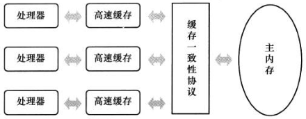
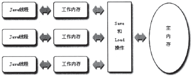

# 一、物理计算机中的问题

## 1、为什么会有高速缓存

- 计算机存储设备和处理器的运算速度有几个数量级的差距；
- 加入一层读写速度尽可能接近处理器运算速度的高速缓存（Cache）作为内存与处理器之间的缓冲。

## 2、运行过程：

- 将运算需要使用到的数据复制到缓存中，让运算能快速运行；
- 运算结束，再从缓存同步回内存；
- 结果：处理器无需等待缓慢的内存读写。

## 3、问题出现：

- 缓存一致性（Cache Coherence）

## 4、问题原因：

- 多处理器系统，每个处理器都有自己的Cache，而这些处理器又共享同一个主内存
- 多个处理器的运算任务涉及到同一块主存区域，将导致各自缓存不一致

  

## 5、问题解决：

- 缓存一致性协议（MSI、MESI、MOSI......）

## 6、内存模型：

- 特定操作协议下，对特定的内存或高速缓存进行读写访问的过程抽象。

## 7、乱序优化：

- 为了使得处理器内部的运算单元能尽量被充分利用，处理器可能会对输入代码进行乱序执行（Out-Of-Order Execution）优化。
- 处理器会在计算之后将乱序执行的结果重组，保证该结果与顺序执行的结果是一致的，但并不保证程序中各个语句计算的先后顺序与输入代码中的顺序一致。
- 如果存在一个计算任务依赖于另一个计算任务的中间结果，那么其顺序性并不能靠代码的先后顺序来保证。

# 二、Java 内存模型
Java 内存模型的作用：

- 屏蔽各种硬件和操作系统的内存访问差异；
- 实现让 Java 程序在各个平台下都能达到一致的内存访问效果。
## 1、主内存与工作内存
Java 内存模型的主要目标：

- 定义程序中各个“变量”的访问规则；
- 此处的“变量”包括实例字段、静态字段和构成数组对象的元素；
- 因局部变量与方法参数是线程私有【注1】，不会被共享，不存在竞争问题，所以“变量”不包括他们。

Java 内存模型规定：

- 所有的变量都存储在主内存
- 每条线程有自己的工作内存
- 工作内存保存了被该线程使用到的变量的主内存副本拷贝【注2】
- 线程对变量的所有操作都是在工作内存中进行的，不可直接读写主内存中的变量【注3】
- 不同线程无法直接访问对方工作内存中的变量
- 线程间变量值的传递都需要通过主内存来完成

  

从上图来看：硬件 <===> Java 虚拟机

- 处理器   <===> Java 线程
- 高速缓存 <===> 工作内存
- 缓存一致性协议 <===> Save 和 Load 操作

注意：

- 若局部变量是 reference 类型，它引用的对象在 Java 堆中可能被各个线程共享，但是 reference 本身在 Java 栈的局部变量表中，它是线程私有的。
- 拷贝副本：假设线程中访问10M的对象，也会把10M内存复制一份吗？不会。这个对象的引用、对象在某个线程访问到的字段是有可能存在拷贝的，但不会把整个对象拷贝一份。
- volatile 变量依然有工作内存的拷贝，但是由于它特殊的操作顺序性规定，所以看起来好像是直接在主内存中读写一样。
## 2、内存间交互操作
8种原子操作：

- lock(锁定)：作用于主内存中的变量，把一个变量标识为一条线程独占的状态。
- unlock(解锁)：作用于主内存中的变量，把一个处于锁定状态的变量释放出来，之后可被其它线程锁定。
- read(读取)：作用于主内存中的变量，把一个变量的值从主内存传输到线程的工作内存中，以便随后的load动作使用。
- load(加载)：作用于工作内存中的变量，把read操作从主内存中得到的变量的值放入工作内存的变量副本中。
- use(使用)：作用于工作内存中的变量，把工作内存中一个变量的值传递给执行引擎。
- assign(赋值)：作用于工作内存中的变量，把一个从执行引擎接收到的值赋值给工作内存中的变量。
- store(存储)：作用于工作内存中的变量，把工作内存中的一个变量的值传送到主内存中。
- write(写入)：作用于主内存中的变量，把store操作从工作内存中得到的变量的值放入主内存的变量中。

注意：

- 把变量从主内存复制到工作内存，必须顺序执行 read 和 load
- 把变量从工作内存同步到主内存，必须顺序执行 store 和 write
- 上述操作必须顺序执行，但不要求连续执行

执行8种基本操作时的规则：

- 不允许read和load、store和write操作之一单独出现。即不允许一个变量从主内存被读取了，但是工作内存不接受，或者从工作内存回写了但是主内存不接受。
- 不允许一个线程丢弃它最近的一个assign操作，即变量在工作内存被更改后必须同步改更改回主内存。 
- 工作内存中的变量在没有执行过assign操作时，不允许无意义的同步回主内存。
- 在执行use前必须已执行load，在执行store前必须已执行assign。 
- 一个变量在同一时刻只允许一个线程对其执行lock操作，一个线程可以对同一个变量执行多次lock，但必须执行相同次数的unlock操作才可解锁。
- 一个线程在lock一个变量的时候，将会清空工作内存中的此变量的值，执行引擎在use前必须重新read和load。
- 线程不允许unlock其他线程的lock操作。并且unlock操作必须是在本线程的lock操作之后。
- 在执行unlock之前，必须首先执行了store和write操作。

上述规则完全确定Java程序中哪些内存访问操作在并发下是安全的。

上述规则的等价定义---先行发生原则。
## 3、volatile 型变量的特殊规则

## 4、long/double 型变量的特殊规则

## 5、原子性、可见性与有序性

## 6、先行发生原则

# 三、Java 与线程

## 1、线程的实现

## 2、线程的调度

## 3、状态转换