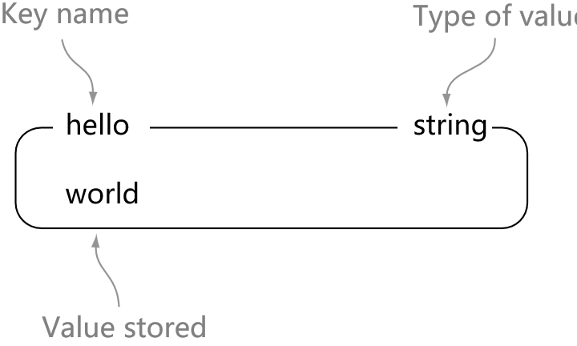
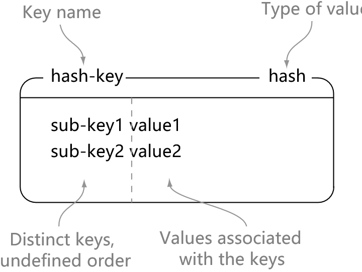

# 一、概述

Redis 是速度非常快的非关系型（NoSQL）内存键值数据库，可以存储键和五种不同类型的值之间的映射。

键的类型只能为字符串，值支持五种数据类型：字符串、列表、集合、散列表、有序集合。

Redis 支持很多特性，例如将内存中的数据持久化到硬盘中，使用复制来扩展读性能，使用分片来扩展写性能。

# 二、数据类型简介

string：

- 可存储的值：字符串、整数或者浮点数
- 操作：对整个字符串或者字符串的其中一部分进行操作；对整数和浮点数执行自增或者自减操作

list：

- 可存储的值：列表
- 操作：从两端压入或者弹出元素；根据偏移量进行修剪，保留某范围内元素；读取单个或者多个元素；按值查找或删除元素

set：

- 可存储的值：无序集合
- 操作：添加、获取、移除单个元素；检查一个元素是否存在于集合中；从集合里面随机获取元素；计算交集、并集、差集

hash：

- 可存储的值：包含键值对的无序散列表
- 操作：添加、获取、移除单个键值对；获取所有键值对；检查某个键是否存在

zset：

- 可存储的值：有序集合
- 操作：添加、获取、删除元素；根据分值范围或者成员来获取元素；计算一个键的排名

> [What Redis data structures look like](https://redislabs.com/ebook/part-1-getting-started/chapter-1-getting-to-know-redis/1-2-what-redis-data-structures-look-like/)

## 1.STRING
结构：
<div align="center">  </div><br>

命令：

- get：获取指定 key 中的数据
- set：设置指定 key 中的值
- del：删除指定 key 中的值（适用于所有类型）

例子：
```html
> set hello world
OK
> get hello
"world"
> del hello
(integer) 1
> get hello
(nil)
```

## 2.LIST
结构：
<div align="center">  </div><br>

命令：

- rpush：将值插入到列表的右端
- lrange：从列表中获取所有值
- lindex：获取列表中给定位置的值
- lpop：弹出列表左端的值并返回它
 
例子：
```html
> rpush list-key item
(integer) 1
> rpush list-key item2
(integer) 2
> rpush list-key item
(integer) 3

> lrange list-key 0 -1
1) "item"
2) "item2"
3) "item"

> lindex list-key 1
"item2"

> lpop list-key
"item"

> lrange list-key 0 -1
1) "item2"
2) "item"
```

## 3.SET
结构：
<div align="center">  </div><br>

命令：

- sadd：把元素添加到集合中
- smembers：返回集合中所有元素
- sismember：检查元素是否在集合中
- srem：如果元素在集合中，则移除它

例子：
```html
> sadd set-key item
(integer) 1
> sadd set-key item2
(integer) 1
> sadd set-key item3
(integer) 1
> sadd set-key item
(integer) 0

> smembers set-key
1) "item"
2) "item2"
3) "item3"

> sismember set-key item4
(integer) 0
> sismember set-key item
(integer) 1

> srem set-key item2
(integer) 1
> srem set-key item2
(integer) 0

> smembers set-key
1) "item"
2) "item3"
```

## 4.HASH
结构：
<div align="center">  </div><br>

命令：

- hset：存储键值对
- hget：获取指定 key 的值
- hgetall：获取哈希表中所有键值对
- hdel：删除指定键值对（如果 key 存在）

例子：
```html
> hset hash-key sub-key1 value1
(integer) 1
> hset hash-key sub-key2 value2
(integer) 1
> hset hash-key sub-key1 value1
(integer) 0

> hgetall hash-key
1) "sub-key1"
2) "value1"
3) "sub-key2"
4) "value2"

> hdel hash-key sub-key2
(integer) 1
> hdel hash-key sub-key2
(integer) 0

> hget hash-key sub-key1
"value1"

> hgetall hash-key
1) "sub-key1"
2) "value1"
```

## 5.ZSET
结构：
<div align="center">  </div><br>

命令：

- zadd：添加元素
- zrange：按存储顺序获取所有元素
- zrangebyscore：按分值顺序获取所有元素
- zrem：移除元素（如果它存在）

例子：
```html
> zadd zset-key 728 member1
(integer) 1
> zadd zset-key 982 member0
(integer) 1
> zadd zset-key 982 member0
(integer) 0

> zrange zset-key 0 -1 withscores
1) "member1"
2) "728"
3) "member0"
4) "982"

> zrangebyscore zset-key 0 800 withscores
1) "member1"
2) "728"

> zrem zset-key member1
(integer) 1
> zrem zset-key member1
(integer) 0

> zrange zset-key 0 -1 withscores
1) "member0"
2) "982"
```

# 三、数据结构深入

## 1.简单动态字符串
### 1.1 SDS定义

```c
struct sdshdr {

    // 字符串长度
    int len;

    // buf 中未使用字节的数量
    int free;

    // 字节数组，为什么是字节数组？为保存二进制数据
    char buf[];
};
```

- SDS遵循C字符串以空字符结尾的惯例，但是那1个字节不计算在len中。
- 为空字符分配额外的 1 字节空间，以及添加空字符到字符串末尾等操作，都是有SDS函数自动完成。
- 遵循C字符串以空字符结尾的惯例：SDS可直接重用一部分C字符串函数库中的函数。

### 1.2 SDS和C字符串的区别
C语言使用的这种简单的字符串表示方式，并不能满足 Redis 对字符串在安全性、效率以及功能方面的要求。
#### 常数复杂度获取字符串长度
问题：

- C语言如果要获取字符串的长度，需要从第一个字符开始，遍历整个字符串，直到遍历到\0符号，时间复杂度是O(N)，即字符串的长度。

解决：

- SDS在len属性中记录了SDS本身长度，所以获取SDS长度的复杂度仅为O(1).

分析：

- 空间换时间：用一个字段存储长度，将获取长度的时间复杂度由 O（N）降低到 O（1）.

好处：

- 即使我们对一个非常长的字符串键反复执行 strlen 命令，也不会对系统性能造成任何影响，因为该命令的复杂度仅为 O（1）.

#### 杜绝缓冲区溢出
问题：

- C字符串不记录自身长度，容易造成缓冲区溢出。
- eg：使用字符串拼接等方式时，就很容易出现此问题。而如果每次拼接之前都要计算每个字符串的长度，时间上又要耗费很久。

解决：

- redis在执行操作之前，其会先检查空间是否足够。如果free的值不够，会再申请内存空间，避免溢出。
#### 减少内存分配次数
问题：

- C语言的字符串长度和底层数组之间存在关联（包含N个字符的字符串的空间是N+1个字符长的数组），因此总要进行内存重分配操作：字符串长度增加时，需要再分配存储空间，避免溢出；字符串长度减少时，需要释放存储空间，避免内存泄漏。

解决：

- redis的SDS，主要是通过free字段，来进行判断。
- 通过未使用空间大小，实现了空间预分配和惰性空间释放。

##### 空间预分配:

- 当需要增长字符串时，sds不仅会分配足够的空间用于增长，还会预分配未使用空间。
- 若SDS修改后，SDS的长度len < 1MB，则分配和 len 一样大小的未使用空间，即len=free.
- 若SDS修改后，len >= 1MB，则分配 1MB 的未使用空间，即free = 1MB。
- 通过该策略，redis 可减少连续执行字符串增长操作时所需的内存重分配次数。
- 每次字符串增长之前，sds会先检查空间是否足够，如果足够则直接使用预分配的空间，否则按照上述机制申请使用空间。

好处：

- 通过空间预分配策略，sds 将连续增长 N 次字符串所需的内存重分配次数从必定 N 次降低为 最多 N 次。 

##### 惰性空间释放
- 懒惰空间释放用于优化sds字符串缩短的操作
- 当需要缩短sds的长度时，并不立即释放空间，而是使用free来保存剩余可用长度，并等待将来使用。
- 当有剩余空间，而又有增长字符串操作时，则又会调用空间预分配机制。
- 当redis内存空间不足时，会自动释放sds中未使用的空间，因此也不需要担心内存泄漏问题。
#### 二进制安全
- SDS 的 API 都是二进制安全的
- 所有 SDS API 都会以处理二进制的方式来处理 SDS 存放在 buf 数组里的数据
- 程序不会对其中的数据做任何限制、过滤、或者假设
- 数据在写入时是什么样的， 它被读取时就是什么样。
- sds判断字符串结束，是通过len属性，而不是通过\0来判断。
- sds的buf属性设置为字节数组的原因：redis 不是用这个数组来保存字符，而是用来保存一系列二进制数据。
#### 兼容部分C语言字符串函数

- redis兼容c语言对于字符串末尾采用\0进行处理，这样使得其可以复用部分c语言字符串函数的代码，实现代码的精简性。

#### 总结
<div align="center">  </div><br>

## 2.链表
### 链表节点的结构

```c
typedef struct listNode{
    //前置节点
    struct listNode *prev;
    //后置节点
    struct listNode *next;
    //节点的值
    void *value;
}listNode;

```
<div align="center">  </div><br>

### 持有链表节点的结构

```c
typedef strcut list{
    //表头节点
    listNode *head;
    //表尾节点
    listNode *tail;
    //链表所包含的节点数量
    unsigned long len;
    //节点值复制函数(dup函数用于复制链表节点所保存的值)
    void *(*dup) (void *ptr);
    //节点值释放值（free函数用于释放链表节点所保存的值）
    void (*free)(void *ptr);
    //节点值对比函数（match函数用于对比链表节点所保存的值和另一个输入值是否相等）
    int (*match)(void *ptr,void *key);
}list;
```
<div align="center">  </div><br>

### redis链表特性
redis自己实现了双端链表

- 双端：获取某前置/后置节点 O(1)
- 无环：表头prev、表尾next 都指向null，访问时以 null 为终点
- 带表头、表尾指针：list 结构中的 head 、tail，访问头尾 O(1)
- 带链表长度：获取节点数量 O（1）
- 多态：void* 指针保存节点值，通过 dup、free、match 为节点设置类型特定函数，可保存不同类型的值
## 3.字典
字典，又称为符号表（symbol table）、关联数组（associative array）或映射（map），是一种用于保存键值对（key-value）的抽象数据结构。

字典中的每个键都是独一无二的，Redis的数据库就是使用字典来作为底层实现的。
### 3.1 字典的实现

- Redis的字典使用哈希表作为底层实现
- 一个哈希表里面可以有多个哈希表节点
- 每个哈希表节点就保存了字典中的一个键值对
#### 3.1.1 哈希表
结构定义：

```c

typedef struct dictht {
    // 哈希表数组
    dictEntry **table;

    // 哈希表大小
    unsigned long size;

    // 哈希表大小掩码，用于计算索引值
    // 总是等于 size - 1
    unsigned long sizemask;

    // 该哈希表已有节点的数量
    unsigned long used;
} dictht;

```

图示：
<div align="center">  </div><br>

#### 3.1.2 哈希表节点
结构定义：
```c
typedef struct dictEntry {
    // 键
    void *key;

    // 值
    union {
        void *val;
        uint64_t u64;
        int64_t s64;
    } v;

    // 指向下个哈希表节点，形成链表
    struct dictEntry *next;
} dictEntry;
```

图示：
<div align="center">  </div><br>
#### 3.1.3 字典
结构定义：
```c
typedef struct dict {
    // 类型特定函数
    dictType *type;

    // 私有数据
    void *privdata;

    // 哈希表
    dictht ht[2];

    // rehash 索引
    // 当 rehash 不在进行时，值为 -1
    int rehashidx; /* rehashing not in progress if rehashidx == -1 */

    // 目前正在运行的安全迭代器的数量
    int iterators; /* number of iterators currently running */
} dict;

typedef struct dictType {

    // 计算哈希值的函数
    unsigned int (*hashFunction)(const void *key);

    // 复制键的函数
    void *(*keyDup)(void *privdata, const void *key);

    // 复制值的函数
    void *(*valDup)(void *privdata, const void *obj);

    // 对比键的函数
    int (*keyCompare)(void *privdata, const void *key1, const void *key2);

    // 销毁键的函数
    void (*keyDestructor)(void *privdata, void *key);

    // 销毁值的函数
    void (*valDestructor)(void *privdata, void *obj);
} dictType;

```
一般情况下，字典只使用 ht[0] 哈希表，ht[1] 哈希表只会在对 ht[0] 哈希表进行 rehash 时使用。

示例：普通状态下的字典
<div align="center">  </div><br>

### 3.2 哈希算法
Redis计算哈希值和索引值的方法如下：

- 使用字典设置的哈希函数，计算键key的哈希值：hash = dict->type->hashFunction(key)
- 使用哈希表的sizemask属性和哈希值，计算出索引值，使用情况不同，ht[x]可以是ht[0]或者ht[1] ：index = hash& dict->ht[x].sizemask;

### 3.3 解决键冲突
链地址法解决冲突：

- 每个 hash 表节点都有一个 next 指针，多个哈希表节点可以用 next 指针构成一个单向链表，被分配到同一个索引上的多个节点可以用这个单向链表连接起来，解决了冲突问题。
- 因为 dictEntry 节点组成的链表没有指向链表表尾的指针，所以为了速度考虑，程序总是将新节点添加到链表的表头位置（O(1)），排在其他已有节点的前面。

<div align="center">  </div><br>
### 3.4 rehash
当哈希表保存的键值对数量太多或者太少时，程序需要对哈希表的大小进行相应的扩展或者收缩。

步骤：

1.为字典的ht[1]哈希表分配空间，这个哈希表的空间大小取决于要执行的操作，以及ht[0]当前包含的键值对数量（也即是ht[0].used属性的值）：

-  如果执行的是扩展操作，那么ht[1]的大小为第一个大于等于ht[0].used*2 的2^n;
-  如果执行的是收缩操作，那么ht[1]的大小为第一个大于等于ht[0].used的2^2;

2.将保存在ht[0]中的所有键值对rehash到ht[1]上面，rehash值的是重新计算键的哈希值和索引值，然后将键值对放置到ht[1]哈希表的指定位置上。

3.当ht[0]包含的所有键值对都迁移到了ht[1]之后（ht[0]变为空表），释放 ht[0],ht[1] 设置为 ht[0],并在 ht[1] 新创建一个空白哈希表，为下一次rehash做准备。
### 3.5 渐进式 rehash
为避免 rehash 对服务器性能造成影响，rehash 不是一次性、集中式完成的，而是分多次、渐进式地完成的。

渐进式 rehash 步骤：

- 为 ht[1] 分配空间，让字典同时持有 ht[0] 和 h[1] 两个哈希表；
- 在字典中维持一个索引计数器变量 rehashidx，并将它的值设置为 0， 表示 rehash 工作正式开始；
- 在 rehash 进行期间，每次对字典执行添加、删除、查找或者更新操作时，程序除了执行指定的操作之外，还会顺带将 ht[0] 哈希表在 rehashidx 索引上的所有键值对 rehash 到 ht[1]，当 rehash 完成后，程序将 rehashidx 属性的值增一；
- 随着字典操作的不断执行，最终在某个时间点上，ht[0] 的所有键值对都会被 rehash 至 ht[1]，这时程序将 rehashidex属性的值设置为-1，表示 rehash 操作已完成。

渐进式 rehash 执行期间的哈希表操作：

- 渐进式 rehash 的过程中，字典同时使用 ht[0] 和 ht[1] 两个哈希表；
- 此时字典的删除、查找、更新等操作会在两个哈希表上进行；
- 新添加到字典的键值对一律会被保存到 ht[1] 里面，而 ht[0] 则不再进行任何添加操作，保证 ht[0] 包含的键值对数量只减不增，并随着 rehash 操作的执行而最终变成空表。

## 4.跳跃表
### 4.1 简介：

- 有序数据结构
- 在每个节点中维持多个指向其他节点的指针，从而达到快速访问节点的目的
- 支持平均O(logN)、最坏O(N)的复杂度的节点查找，还可以通过顺序性操作来批量处理节点
- 是有序集合键的底层实现之一
- Redis 只在两个地方用到了跳跃表，一个是实现有序集合键，另一个是在集群节点中用作内部数据结构

### 4.2 实现
Redis 的跳跃表由redis.h/zskiplistNode 和redis.h/zskiplist 两个结构定义

- zskiplistNode 结构用于表示跳跃表节点
- zskiplist 结构则用于保存跳跃表节点的相关信息

<div align="center">  </div><br>

zskiplist 结构：

- header ：指向跳跃表的表头节点
- tail ：指向跳跃表的表尾节点
- level ：记录目前跳跃表内，层数最大的那个节点的层数（表头节点的层数不计算在内）
- length ：记录跳跃表的长度，也即是，跳跃表目前包含节点的数量（表头节点不计算在内）

zskiplistNode 结构：

- 层（ level ）：节点中用Ll 、L2 、L3 等字样标记节点的各个层， Ll 代表第一层， L2代表第二层，以此类推。每个层都带有两个属性：前进指针和跨度。前进指针用于访问位于表尾方向的其他节点，而跨度则记录了前进指针所指向节点和当前节点的距离。在上面的图片中，连线上带有数字的箭头就代表前进指针，而那个数字就是跨度。当程序从表头向表尾进行遍历时，访问会活着层的前进指针进行。
- 后退（ backward ）指针：节点中用BW 字样标记节点的后退指针，它指向位于当前节点的前一个节点。后退指针在程序从表尾向表头遍历时使用。
- 分值（ score ）：各个节点中的1.0 、2.0 和3.0 是节点所保存的分值。在跳跃表中，节点按各自所保存的分值从小到大排列。
- 成员对象（ obj ）：各个节点中的。1 、。2 和o3 是节点所保存的成员对象。

## 5.整数集合

- 整数集合是集合键的底层实现之一
- 整数集合的底层实现为数组，这个数组以有序、无重复的方式保存集合元素，在有需要时，程序会根据新添加元素的类型，改变这个数组的类型
- 升级操作为整数集合带来了操作上的灵活性，并且尽可能地节约了内存
- 整数集合只支持升级操作，不支持降级操作
## 6.压缩列表

- 压缩列表是一种为节约内存而开发地顺序型数据结构
- 压缩列表被用作列表键和哈希键地底层实现之一
- 压缩列表可以包含多个节点，每个节点可以保存一个字节数组或者整数值
- 添加新节点到压缩列表，或者从压缩列表中删除节点，可能会引发连锁更新操作，但这种操作出现地几率并不高
## 7.对象

- redis 数据库中的每个键值对的键和值都是一个对象
- redis 共有字符串、列表、哈希、集合、有序集合五种类型的对象，每种类型的对象至少都有两种或以上的编码方式，不同的编码可以在不同使用场景上优化对象的使用效率
- 服务器在执行某些命令之前，会先检查给定键的类型能否执行指定的命令，而检查一个键的类型就是检查键的值对象的类型
- redis 对象系统带有引用计数实现的内存回收机制，当一个对象不再被使用时，该对象所占用的内存就会被自动释放
- redis 会共享值为 0 到 9999 的字符串对象
- 对象会记录自己的最后一次被访问的时间，这个时间可以用于计算对象的空转时间

# 参考资料

- 黄健宏. Redis 设计与实现 [M]. 机械工业出版社, 2014.
